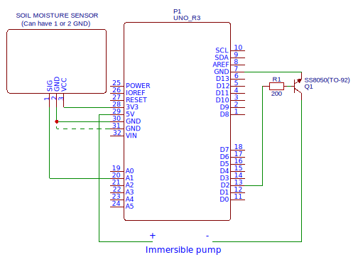

# **ArduinoWatering**  
(**Work in progress**)  
An attempt to make a simple automated watering system using Arduino Uno board, soil moisture sensor and immersible pump (maybe air humidity sensor for some plants).  

## Plants  
+ Thuja (operates)  
+ Ivy (testing) (in `FourHandedOne` - with relay shield)  

## Current schematic  

